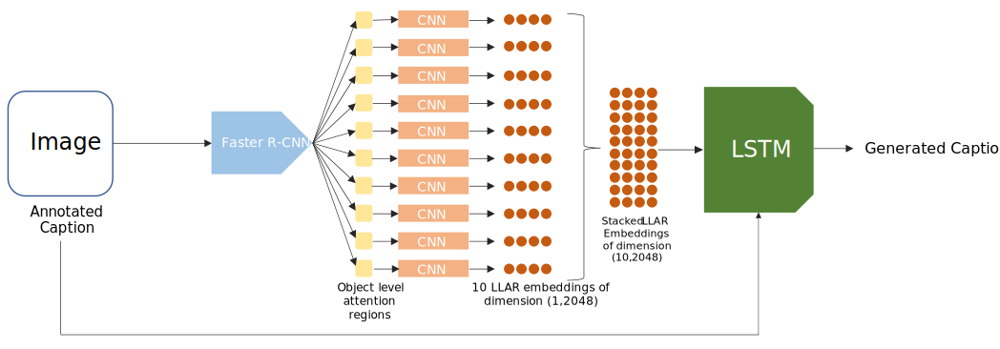

# Panoptic Faster R-CNN Hard Attention Image Captioning with beam search object proposal reinforcement

The following is a list of proposed improvements on the Hard Attention model:
- Introduce low-level attention regions by using the bounding boxes produced by the object detection and localization model Faster R-CNN model
- Rescore the caption proposals during inference by utilizing beam search and reinforcing instances that contain object classes proposed by Faster R-CNN
- Introduce a language model that rescores the caption proposals of the beam search algorithm
- Augment more than 5 captions per image using a pre-trained language model such as BERT/GPT-2/GPT-3.

The majority of the above proposed improvements rely on the object classes and bounding boxes produced by the Faster R-CNN model. Therefor a dataset annotated with bounding boxes and class labels is necessary. My previous models were trained on the Flickr8k dataset which only consisted of images paired with 5 captions per image. MSCOCO is an alternative and the standard dataset used for the task of image caption generation, and consists of roughly 300,000 image-caption pairs. Unfortunately, the computational resources necessary to train on such a large dataset is quite demanding and is not feasible for a low-resource computer such as my own. 

Luckily, [Flickr30k Entities](https://arxiv.org/abs/1505.04870) provides a relatively small dataset consisting of ~30,000 image caption pairs along with manually annotated object class labels and  object localization bounding boxes. For the purpose of fine-tuning the Faster R-CNN, Flickr30k will be used. There is a large overlap in images contained within the Flickr8k and Flickr30k datasets, so therefor the fine-tuned Faster R-CNN will be used during the encoding stage when trained on the Flickr8k dataset.

In improving the accuracies of the Hard Attention model on the Flickr8k dataset, we may indicate potential techniques that can be used in more complex models that are trained on larger datasets, such as MSCOCO.

## Proposed improvements in more detail
In this work, we adopt and extend the architecture proposed in [Show, Attend and Tell](https://arxiv.org/pdf/1502.03044.pdf) since it is the most cited seminal work in the area of image captioning. It introduced the encoder-decoder architecture and the visual attention mechanism for image captioning in a simple yet powerful approach. For more information on this model, see my previous [repo](https://github.com/mikkkeldp/hard-attention-image-captioning).

Compared to Show, Attend and Tell, other captioning approaches are task specific, more complex and derivative in nature. Moreover, we believe the simplicity of the Show, Attend and Tell model, compared to it’s other counterparts, would help to add explainability into the captioning task. This approach uses a transparent attention mechanism which, in the domain of sequence-to-sequence tasks, translates to the ability to dynamically select important features in the image instead of maintaining one feature representation for the image at all times.  

The proposed improvements on the Hard Attention model proposed in Show, Attend, and Tell will now be further discussed in more detail.

**Panoptic Attention Regions**  
The purpose of an attention mechanism is for the model to shift it's focus based on the next word that is being predicted by the model. The attention regions therefore provides context to the decoder based on a partially generated caption. In doing so, these features often fail to attend and provide direct visual cues, i.e., specific object details, to the decoder.

The Hard Attention model proposed in Show, Attend and Tell makes use of high-level image abstractions obtained from convolutional layers within a pre-trained object detection model, such as VGG-16. The image features obtained from the conv. layers acting as attention regions lack low-level object specific details. 

We explore the possibilities to make this attention mechanism more effective by introducing low-level attention regions. For each input image, we embed a constant number of localized bounding boxes from a fine-tuned Faster R-CNN model. In doing, so we augment attention regions for the decoder to choose from when predicting the next word in the sequence. The produced attention regions will be object level. A possible drawback to this approach will be that the model will not have the entire context available - since the Faster R-CNN only produces object in the foreground and does not provide background context such as location of the objects within the scene. For instance, an image where two boys are running on a beach. The Faster R-CNN will may only produce the bounding boxes of the two boys, and not produce an attention region containing information about the beach. 

To remedy this possible drawback, the joint embedding of the high-level attention regions produced by the convolutional layers and the low-level features produced by Faster R-CNN, will also be explored. 

<figure>

  

  <figcaption>Figure 1 - Pipeline of the panoptic attention regions. The image is first fed to the Faster R-CNN to produce ten bounding boxes of the objects within the image. These bounding boxes are used as the low-level attention regions (LLARs). The bounding boxes are then fed to a CNN such as ResNet-152 in order to embed the augmented attention regions. The last fully connected layer (1x2048 dimension) is taken as the feature vector representation. The LLARs are then stacked and fed to the LSTM (decoder).</figcaption>
</figure>

<figure>

  

  <figcaption>Figure 2 - Pipeline of the panoptic attention regions along with the high level attention regions (HLAR) used in the original paper. The image is fed to the ResNet-152 CNN and the feature map of a convolutional layer is taken. A 14x14 feature map is generated with each grid being of dimension 1x2048. We flatten this out to give the embedding a dimension of 196x2048. The HLARs are then concatenated with the LLARs to form a embedding with dimension 206x2048</figcaption>
</figure>

**Faster R-CNN object class proposals reinforcement**  
The standard decoding technique is known as greedy search which selects the most likely word at each step in the output sequence of the LSTM. This approach has the benefit that it is very fast, but the quality of the final output sequences may be far from optimal.

Opposed to greedy search, beam search expands all possible next steps and keeps the **k** most likely, where **k** is a user-specified parameter and controls the number of beams or parallel searches through the sequence of probabilities.

By using the object labels proposed by the Faster R-CNN, we can reinforce beam instances where the proposed object labels occur. This would insure that instances that contain the correct objects are contained within the beam-width and chosen as the most likely generated caption. This would of course rely on the Faster R-CNN object labels to be accurate. 

Further, we could also reinforce objects that are of similar semantic meaning. This can be done by calculating the cosine distance between the proposed words and the proposed Faster R-CNN object labels. A minimum cosine distance threshold would have to be chosen whether to reinforce the beam instance or not. 

**Language modelling re-scoring**  

During beam search inference, each partially generated caption will be rescored by combining the probability score produced by the LSTM and the probability score produced by a pre-trained language model such as BERT/GPT-2/GPT-3. This would suppress semantically unlikely captions generated during beam-search. 

**Image caption augmentation**  
For further improvement on the model, we test whether the model would benefit from augmented captions generated by a pre-trained language model. The Flickr30k dataset provides 5 human generated captions per image. From this given captions, augmented captions could be generated by randomly substituting words with synonyms.

## Results 

I've included the scores produced by the state of the art models (on this dataset), as well as the models produced by my previous attempts. For the baseline (Hard Attention), only high-level attention regions (HLAR) computed by the convolutional layers from a pre-trained object detection neural network, such as VGG or ResNet.  The original paper uses VGG-16 to produce the attention regions. For my implementation I make use of ResNet-152.

| Abbreviation | Description |
| ------       | ---------   |
| JE        | Joint embedding of the high-level attention regions produced by the convolutional layers and the low-level features produced by Faster R-CNN, can also be explored. |
| LLAR | Low level attention regions achieved through embedding the bounding boxes produced by Faster R-CNN|

| Model                                                         | BLEU-1 | BLEU-2 | BLEU-3 | BLEU-4 |
|---------------------------------------------------------------|--------|--------|--------|--------|
| [ Hard attention (Xu et al.,2016)](https://arxiv.org/pdf/1502.03044.pdf)           |   67   |  45.7  |  31.4  |  21.3  |
| [Google NIC (Vinyals et al., 2014)](https://arxiv.org/pdf/1411.4555.pdf)           |   63   |   41   |   27   |    -   |
| [Log Bilinear (Kiros et al., 2014)](http://proceedings.mlr.press/v32/kiros14.pdf)  |  65.6  |  42.4  |  27.7  |  17.7  |
| [Merge (Tanti et al., 2017)](https://arxiv.org/pdf/1708.02043.pdf)                 | 60.1   | 41.1   | 27.4   | 17.9   |
| Merge-EfficientNetB7-Glove-RV                                                      | 63.62  | 40.47  | 26.63  | 16.92  |
| Hard attention (my implementation)                                                 | 66.54  | 45.8  | 31.6  | 20.93  |
| Hard attention ResNet-101                                                          | 66.73  | 45.45  | 31.81  | 22.14  |
| Panoptic Hard Attention LLAR                                                       | 56.52  | 39.42  | 28.34 | 11.14  |
| Panoptic Hard Attention JE                                                         | **68.4**  |  **46.05** | **32.66** |  **22.78** |

--- 

## Results discussion
...

## TODO
 - [ ] Beam Search Faster R-CNN object class proposals reinforcement
 - [ ] Beam Search Language modelling re-scoring
 - [ ] Image caption augmentation
 - [ ] Use EfficientNet-B7 for encoding of low-level attention regions (Faster R-CNN bounding boxes) and extraction of feature maps for high-level attention regions.
 - [ ] Add second layer of LSTM

# APPENDIX
## Fine-tuning of the Faster R-CNN
We make use of [Faster R-CNN](https://dl.acm.org/doi/10.5555/2969239.2969250), which is an object detection network that produces bounding boxes along with class labels and probability scores. 

We make use of a Faster R-CNN model pre-trained on MSCOCO and fine-tuned on the Flickr30k Entities dataset. 

## Flickr30k Entities Dataset

This paper/dataset presents Flickr30k Entities, which is an augmented 58k captions for Flickr30k with 244k coreference chains, linking mentions of the same entities across difference captions for the same image, associating them with 276k manually annotated bounding boxes. Such annotations are essential for continued progress in automatic image description and grounded language understanding.  They enable us to define a new benchmark for localization of textual entity mentions in an image. This dataset was annotated using crowd-sourcing. 

Due to a lack of datasets that provide not only paired sentences and images, but detailed grounding of specific phrases in image regions, most of these methods attempt to directly learn mappings
from whole images to whole sentences. Not surprisingly, such models have a tendency to reproduce generic captions from the training data, and to perform poorly on compositionally novel images whose objects may have been seen individually at training time, but not in that combination.

<figure>
  

  

  <figcaption>Figure 1 - Example annotations from our dataset. In each group of captions describing the same image, coreferent mentions (coreference chains) and their corresponding bounding boxes are marked with the same color. On the left, each chain points to a single entity (bounding box). Scenes and events like “outside” or “parade” have no box. In the middle example, the people (red) and flags (blue) chains point to multiple boxes each. On the right, blue phrases refer to the bride, and red phrases refer to the groom. The dark purple phrases (“a couple”) refer to both of these entities, and their corresponding bounding boxes are identical to the red and blue ones.</figcaption>
</figure>

Our new dataset, Flickr30k Entities, augments Flickr30k by identifying which mentions among the captions of the same image refer to the same set of entities, resulting in 244,035 coreference chains, and which image regions depict the mentioned entities, resulting in 275,775 bounding boxes. Figure 1 illustrates the structure of our annotations on three sample images.

Traditional object detection assumes a predefined list of semantically distinct classes with many training examples for each. By contrast, in phrase localization, the number of possible phrases
is very large, and many of them have just a single example or are completely unseen at training time. Also, different phrases may be very semantically similar (e.g., infant and baby), which makes it difficult to train separate models for each. And of course, to deal with the full complexity of this task, we need to take into account the broader context of the whole image and sentence, for example, when disambiguating between multiple entities of the same type.

The comparison between MSCOCO and Flickr30k Entities is shown in the table below:

| Dataset                  | Images  | Objects Per Image | Object Categories | Captions Per Image |
|--------------------------|---------|-------------------|-------------------|--------------------|
| Flickr30k Entities [(Plummer et al., 2015)](https://arxiv.org/abs/1505.04870)      | 31,783  | 8.7               | **44,518**            | 5                  |
| MSCOCO [(Lin et al., 2014)](https://arxiv.org/abs/1405.0312) | 328,000 | 7.7               | 91                | 5                  |

 For our dataset, we define Object Categories as the set of unique phrases after
filtering out non-nouns in our annotated phrases (note that Scene Graph and Visual Genome also have very large numbers in this column because they correspond essentially to the total numbers of unique phrases). 

As we notice from the comparison, the Flickr30k dataset has a diverse set of objects compared to the MSCOCO dataset (with 10 times more image instances).

### Flickr30k Entities Dataset Pre-Processing
Object categories were grouped into 9 classes, namely: people, clothing, bodyparts, animals, vehicles, instruments, scene, other. 

For our purpose of object detection and localization, these groupings are not useful, as we want the specific object class. We use the original object classes with 44,518 classes, with some ambiguity between them. For instance, there exists an object class of *infant*, as well as *baby*, with the two object categories having the same semantic meaning. For this reason some pre-processing is needed. Below is the object class distribution of the top 100 object categories before pre-processing.

<figure>
  

  <figcaption>Figure 1 - Example annotations from our dataset. In each group of captions describing the same image, coreferent mentions (coreference chains) and their corresponding bounding boxes are marked with the same color. On the left, each chain points to a single entity (bounding box). Scenes and events like “outside” or “parade” have no box. In the middle example, the people (red) and flags (blue) chains point to multiple boxes each. On the right, blue phrases refer to the bride, and red phrases refer to the groom. The dark purple phrases (“a couple”) refer to both of these entities, and their corresponding bounding boxes are identical to the red and blue ones.</figcaption>
</figure>

From observing the class labels above, we notice there are some non-visual or nonsensical classes such as *one*. We also note some semantically similar classes such as shirt and t-shirt. 

The following pre-processing was done to the Flickr30k Entities annotations:

- Remove non-visual object class instances
- Remove nonsensical object class instances
- made all the object classes to lowercase 
- Limit the object classes to the top-100 most frequently occurring object classes and disregard the remaining object class instances

In only taking the top-100 object classes we significantly reduce the possible object classes Faster R-CNN has to predict and hopefully leads to more informatory attention regions for the Hard Attention model.